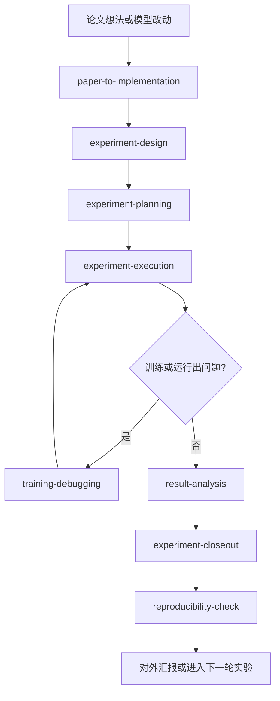

# Superpowers DL

[English](README.md) | **简体中文**

面向 Agentic Coding 工具的深度学习研究工作流。

这个 fork 是基于原版 Superpowers 改造的一个研究导向分支。原版更适合通用软件工程场景，而这里更聚焦模型研究：先定义假设，再设计最小可证伪实验，执行时保留完整证据链，系统化排查训练故障，分析结果，最后才决定是否宣称改进成立。

## 为什么要做这个 Fork

很多深度学习迭代的问题，本质上不是“写代码慢”，而是流程失控：

- 假设、baseline 和指标还没定清楚，就先开始改代码
- 一轮实验里同时改了多个变量，最后很难解释结果
- 训练故障靠经验拍脑袋修，而不是定位根因
- 单次好运结果被当成稳定结论
- 真到要分享结果时，配置、seed、commit 和产物又找不全

这个 fork 的目标，就是把这些高频失控点变成明确的技能和约束。

## 适合谁

如果你的工作主要是这些内容，这个 fork 会更合适：

- 论文复现
- 模型结构、loss、数据增强或训练策略改动
- 训练问题排查和实验分诊
- baseline 与 ablation 对比
- 对外分享结果前的复现核查

如果你主要需要的是通用产品研发工作流，更适合直接使用上游 Superpowers。

## 相比上游改了什么

- 去掉了偏软件工程的工作流技能
- 仓库围绕深度学习实验设计、执行、调试、结果解释和复现检查重建
- 安装说明全部指向这个 fork，而不是上游 `obra/superpowers`

## 研究工作流

这个 fork 围绕一套可重复的研究闭环组织：



1. `paper-to-implementation`
   把论文思路翻译成最小、忠实、可本地验证的实验。
2. `experiment-design`
   在动代码前锁定假设、baseline、指标、数据假设和算力预算。
3. `experiment-planning`
   把设计落成明确的代码改动、sanity check、运行步骤和产物保存要求。
4. `experiment-execution`
   按计划执行，控制变量，保留过程证据。
5. `training-debugging`
   系统化处理 NaN、发散、OOM、指标异常等训练问题。
6. `result-analysis`
   对 baseline、ablation 和 rerun 做保守分析，判断证据真正支持什么。
7. `experiment-closeout`
   每轮实验后明确决定代码保留还是回滚。
8. `reproducibility-check`
   在宣称改进前，核对命令、配置、seed、commit、数据版本、产物和指标表。

在 Claude Code 和 Codex 这类支持的环境里，`using-superpowers` 会尽早介入，把研究任务路由到合适的流程里。

## 内置技能

| 技能 | 作用 |
| --- | --- |
| `paper-to-implementation` | 拆出论文的核心改动与隐藏前提，并映射到本地代码。 |
| `experiment-design` | 把模糊想法整理成可证伪的实验卡片。 |
| `experiment-planning` | 输出包含文件、命令、检查项和产物要求的执行计划。 |
| `experiment-execution` | 先实现并运行最小、最关键的验证实验。 |
| `training-debugging` | 定位并证明训练故障的根因。 |
| `result-analysis` | 保守比较 baseline、ablation 和 rerun，决定下一步。 |
| `experiment-closeout` | 判断实验代码应该保留还是回滚。 |
| `reproducibility-check` | 用证据链约束性能宣称。 |
| `using-superpowers` | 在会话开始时强制进入 skill-first 工作方式。 |

## 快速开始

先把这个 fork 安装到你的 agent 环境里，然后直接用自然语言描述研究任务。

示例 prompt：

- "I want to try rotary embeddings in this model."
- "Training goes to NaN after warmup."
- "Compare these ablations and tell me what to run next."
- "Help me reproduce this paper fairly."
- "I changed the loss and validation improved once. What evidence do I still need?"

你也可以显式指定技能，比如 `use experiment-design` 或 `use training-debugging`。

## 安装

请优先使用本仓库里的安装文档，而不是上游 marketplace 入口。

### Codex

告诉 Codex：

```text
Fetch and follow instructions from https://raw.githubusercontent.com/ziangbuchu/mysuperpowers/refs/heads/main/.codex/INSTALL.md
```

手动安装说明：[docs/README.codex.md](docs/README.codex.md)

### Claude Code

仓库里保留了 `.claude-plugin/` 和 `hooks/`，用于 Claude Code 的本地插件加载与测试。可参考 `tests/claude-code/` 里的 `--plugin-dir` 用法。

## 核心原则

- 假设先于实现
- 最小可证伪实验优先
- baseline 必须公平
- 失败实验也应在丢弃代码前完成归档
- 证据优先于直觉
- 可复现优先于讲故事

## 仓库结构

- `skills/`: 研究工作流技能
- `commands/`: 核心技能的轻量快捷入口
- `hooks/`: 支持平台的会话启动钩子
- `agents/`: 可复用的 reviewer agent
- `docs/`: Claude Code / Codex 安装文档和项目说明
- `tests/`: skill 触发和 Claude Code smoke test

## 贡献

新增或修改技能时，直接编辑 `skills/`。

- 每个 `SKILL.md` 保持简洁
- 细节较多的内容放进 `references/`
- 新增触发路径或改动路由行为时，同步更新测试

## 许可证

MIT License
