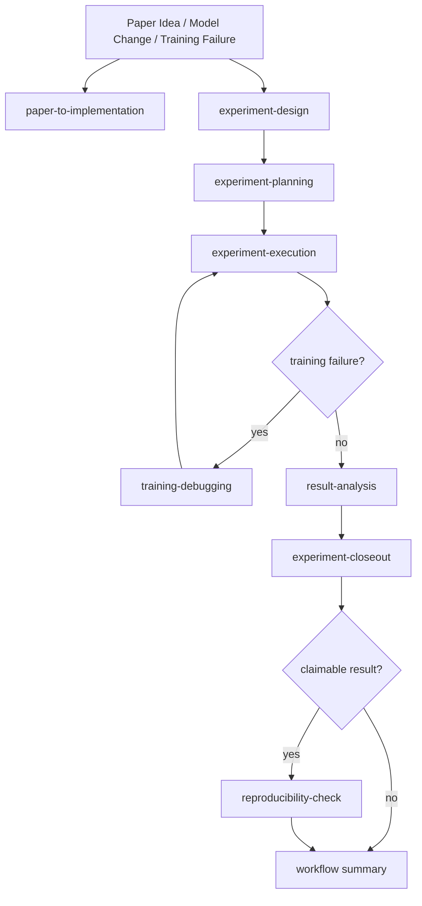

# Superpowers DL

[English](docs/README.codex.md) | **简体中文**

面向 Agentic Coding 工具的深度学习研究工作流技能集。

这个 fork 的重点不是“多一个 skill”，而是把研究任务组织成可续接的 workflow：从任一阶段进入都可以，但阶段之间不再依赖人工复制上下文。

## 一句话

把它理解成一套“面向深度学习研究的 workflow skill system”：

- 不确定该先设计、先调试还是先分析时，它会帮你选阶段
- 每个阶段结束后会自动保存交接物，而不是让你手工复制上下文
- 新会话里可以直接继续上一个实验，而不是重新讲一遍背景

## 你会得到什么

- 一个问题对应一个 workflow，而不是一串松散对话
- skill 可单独使用，也可自动挂接到 workflow
- 设计、规划、执行、调试、分析、收尾、复现检查之间有统一状态协议
- 最后有统一 summary，可作为实验结论、下一步建议和 Git 收尾入口

## 最快上手

如果你刚装好，只要先记住这 3 句：

```text
请为这个问题选择合适的 superpowers skill，并从最早的有效阶段开始。
continue current workflow
workflow summary
```

## 现在解决什么问题

很多深度学习迭代的问题，不是代码改不动，而是阶段之间断裂：

- 设计阶段说过的假设、baseline、指标，到了 planning/execution 还要再贴一遍
- 调试、分析、收尾阶段经常拿不到前面的运行信息
- 新会话里很难自然续上前一个实验
- 最终总结和对外宣称没有统一出口

这个版本把这些问题收敛成一套 project-local workflow 协议。

## 核心变化

- skill 可以单独使用，也可以自动挂接到 workflow
- workflow 状态默认保存在当前项目的 `.superpowers/workflows/`
- 每个阶段结束都会写阶段摘要，并给出下一阶段和继续口令
- `workflow summary` 在结论支持保留代码时可以继续接管分支选择、commit 草案和确认提交
- Claude 的 `commands/` 与 `SessionStart` hook 现在都支持 workflow-aware 入口
- Codex 侧统一支持自然语言入口：
  - `请为这个问题选择合适的 superpowers skill`
  - `continue current workflow`
  - `workflow status`
  - `workflow summary`

## Canonical Workflow



允许从任一阶段进入，但一旦 workflow 建立，后续阶段默认复用同一套状态和工件。

## Workflow State

workflow 状态写在“当前研究项目”里，而不是写在 superpowers skills 仓库里。

固定路径：

- `.superpowers/workflows/ACTIVE`
- `.superpowers/workflows/<workflow_id>/workflow.json`
- `.superpowers/workflows/<workflow_id>/stages/<stage>.md`
- `.superpowers/workflows/<workflow_id>/final-summary.md`

正式的人类可读实验文档仍然写在：

- `docs/experiments/specs/`
- `docs/experiments/plans/`
- `docs/experiments/results/`

这套状态协议定义在 [skills/_shared/workflow-protocol.md](/data/lf/code/mysuperpowers/skills/_shared/workflow-protocol.md)。

## 快速开始

安装后，不需要记住很多 skill 名。优先记住这几条入口：

### 1. 不确定从哪开始

```text
请为这个问题选择合适的 superpowers skill，并从最早的有效阶段开始。
```

### 2. 明确从某个阶段开始

```text
use experiment-design
```

或：

```text
use training-debugging
```

### 3. 继续上一个 workflow

```text
continue current workflow
```

### 4. 查看状态或总结

```text
workflow status
workflow summary
```

## Claude Commands

Claude Code 下提供这些快捷入口：

- `design-experiment`
- `plan-experiment`
- `run-experiment`
- `debug-training`
- `analyze-results`
- `close-experiment`
- `check-reproducibility`
- `reproduce-paper`
- `continue-workflow`
- `workflow-status`
- `workflow-summary`

这些 command 现在都会先解析或创建 workflow，再进入目标 skill。

## 典型使用方式

### 新想法，还没开始改代码

```text
请为这个问题选择合适的 superpowers skill，并从最早的有效阶段开始。

任务：
我想尝试 boundary-aware supervision 来改善细结构分割。
```

### 新会话里继续之前的实验

```text
continue current workflow
```

### 跑完了，但只想看现在的结论

```text
workflow summary
```

如果 workflow 已经明确应当保留代码，`workflow summary` 还会继续给出分支选择、详细 commit 草案和提交确认。

### 准备发到组里前再过一遍证据

```text
use reproducibility-check
```

## 完整例子

下面用一个完整例子说明 workflow 是怎么走的。

场景：你想给现有分割模型加 `boundary-aware supervision`，看看能不能提升细结构的边界 F1。

1. 在新会话里先说：

   ```text
   请为这个问题选择合适的 superpowers skill，并从最早的有效阶段开始。

   任务：
   我想尝试 boundary-aware supervision 来改善细结构分割。
   当前 baseline 是 UNet + Dice/BCE。
   ```

2. 系统会先进入 `experiment-design`，而不是直接改代码。它会先明确：
   - hypothesis
   - baseline
   - metric
   - dataset split
   - compute budget
   - first falsifier

   这一阶段会写入：
   - `docs/experiments/specs/2026-xx-xx-<topic>.md`
   - `.superpowers/workflows/ACTIVE`
   - `.superpowers/workflows/<workflow_id>/workflow.json`
   - `.superpowers/workflows/<workflow_id>/stages/experiment-design.md`

3. 你认可设计后，不需要把 design 内容再复制给 planning，只要说：

   ```text
   continue current workflow
   ```

4. 系统会进入 `experiment-planning`，把设计转成：
   - 要改哪些文件
   - 需要哪些 sanity check
   - 运行命令怎么写
   - 要保存哪些 artifact
   - 什么情况下停止

   并写入：
   - `docs/experiments/plans/2026-xx-xx-<topic>.md`
   - `.superpowers/workflows/<workflow_id>/stages/experiment-planning.md`

5. 你再说一次：

   ```text
   continue current workflow
   ```

6. 系统会进入 `experiment-execution`，记录：
   - start commit
   - branch
   - touched files
   - sanity results
   - run command / config / seed / output dir

   这些信息会写回 `workflow.json`，所以后面调试和分析不需要你重新贴运行信息。

7. 如果训练在 step 400 左右变成 NaN，你可以说：

   ```text
   use training-debugging
   ```

   它会进入 `training-debugging`，复用 execution 里记录的 run 信息，去做：
   - 缩小到最小可复现配置
   - 判断问题属于哪一类
   - 加观测点
   - 找正常 run 和异常 run 最早分叉的位置
   - 一次只改一个变量

   然后把根因和下一步写回 workflow。

8. 调试完或实验跑完后，再说：

   ```text
   continue current workflow
   ```

   它会进入 `result-analysis`，保守比较 baseline、ablation、rerun，判断结果真正支持什么，并写入：
   - `docs/experiments/results/2026-xx-xx-<topic>.md`
   - `.superpowers/workflows/<workflow_id>/stages/result-analysis.md`

9. 然后继续：

   ```text
   continue current workflow
   ```

   它会进入 `experiment-closeout`，明确问你：
   - keep code changes
   - discard code changes
   - pause decision

   并生成：
   - `.superpowers/workflows/<workflow_id>/final-summary.md`

   如果你选择 keep，后续再执行 `workflow summary` 时，系统可以直接接上 Git 收尾：
   - 继续当前分支提交
   - 新建分支后提交
   - 只生成详细 commit 草案

10. 如果你准备对外说“这个改动确实更好”，最后再说：

    ```text
    use reproducibility-check
    ```

    它会检查：
    - command
    - config
    - seed
    - commit
    - dataset split
    - checkpoint / artifact
    - metric table

    证据足够才允许宣称改进成立。

这个例子的关键点是：你不再需要手工传递 design、planning、execution、debugging、analysis 之间的上下文，因为这些内容都会沉淀到：

- `.superpowers/workflows/ACTIVE`
- `.superpowers/workflows/<workflow_id>/workflow.json`
- `.superpowers/workflows/<workflow_id>/stages/*.md`
- `.superpowers/workflows/<workflow_id>/final-summary.md`

## 安装

### Codex

告诉 Codex：

```text
Fetch and follow instructions from https://raw.githubusercontent.com/ziangbuchu/mysuperpowers/refs/heads/main/.codex/INSTALL.md
```

更多说明见 [docs/README.codex.md](/data/lf/code/mysuperpowers/docs/README.codex.md) 和 [docs/README.codex.zh-CN.md](/data/lf/code/mysuperpowers/docs/README.codex.zh-CN.md)。

### Claude Code

仓库保留了 `.claude-plugin/` 和 `hooks/`，可通过本地 plugin 方式加载。`SessionStart` hook 会在可行时注入 active workflow 的摘要和继续口令。

## FAQ

### 到一个新项目里，使用 superpowers 会自动创建 `.superpowers/workflows/` 吗？

不是“只要用了 superpowers 就立刻创建”，而是：

- 普通问答、查看 skill 列表、问怎么用时，不应该创建
- 第一次正式进入 workflow-aware 阶段时，应该在当前项目根目录创建

典型会触发创建的输入：

```text
请为这个问题选择合适的 superpowers skill，并从最早的有效阶段开始。
use experiment-design
use training-debugging
```

预期会创建这些目录或文件：

- `.superpowers/workflows/`
- `.superpowers/workflows/ACTIVE`
- `.superpowers/workflows/<workflow_id>/workflow.json`
- `.superpowers/workflows/<workflow_id>/stages/`
- `docs/experiments/specs/`
- `docs/experiments/plans/`
- `docs/experiments/results/`

一句话说：开始一个真实 workflow 时自动创建，而不是一加载 skill 就创建。

## 仓库结构

- `skills/`: 研究阶段技能
- `skills/_shared/`: workflow 协议、模板和状态示例
- `commands/`: Claude Code 的 workflow-aware 快捷入口
- `hooks/`: 会话启动增强
- `docs/`: 安装、使用与测试说明
- `docs/experiments/`: workflow 生成的人类可读实验文档目录
- `tests/`: skill、hook 和 workflow 合同测试

## 测试

常用测试入口：

```bash
./tests/claude-code/run-skill-tests.sh
./tests/hooks/test-session-start.sh
./tests/workflow/test-workflow-contracts.sh
./tests/workflow/test-workflow-summary-git-handoff.sh
```

更多说明见 [docs/testing.md](/data/lf/code/mysuperpowers/docs/testing.md)。

## 许可证

MIT License
